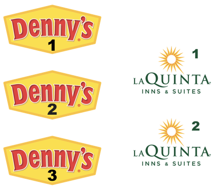
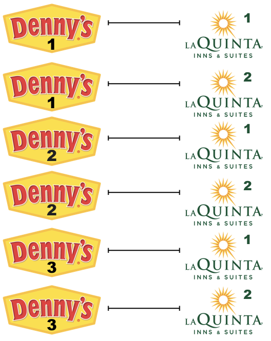

# Lab: Wrangling spatial data {#lab05}
## La Quinta is Spanish for *next to Denny's*, Pt. 2"


In this lab, we revisit the Denny's and La Quinta Inn and Suites data we visualized in the previous lab.

## Getting started

- Go to the course organization on GitHub.

- Find your lab repo.

- In the repo, click on the green **Clone or download** button, select  **Use HTTPS** (this might already be selected by default, and if it is,  you'll see the text **Clone with HTTPS** as in the image below). Click on  the clipboard icon to copy the repo URL.

- Go to RStudio Cloud and into the course workspace. Create a **New Project from Git Repo**. You will need to click on the down arrow next to the **New Project** button to see this option.

- Copy and paste the URL of your assignment repo into the dialog box:

- Hit OK, and you're good to go!

### Packages

In this lab we will use the **tidyverse** and **dsbox** packages.


```r
library(tidyverse) 
library(dsbox) 
```

### Housekeeping

#### Password caching

If you would like your git password cached for a week for this project, type the following in the Terminal:


```bash
git config --global credential.helper 'cache --timeout 604800'
```

#### Project name

Currently your project is called *Untitled Project*. Update the name of your project to be "Lab 04 - Wrangling spatial data".

## Warm up

**Pick one team member to complete the steps in this section while the others contribute to the discussion but do not actually touch the files on their computer.**

Before we introduce the data, let's warm up with some simple exercises.

### YAML 

Open the R Markdown (Rmd) file in your project, change the author name to your **team** name, and knit the document.

### Commiting and pushing changes:

- Go to the **Git** pane in your RStudio. 
- View the **Diff** and confirm that you are happy with the changes.
- Add a commit message like "Update team name" in the **Commit message** box and hit **Commit**.
- Click on **Push**. This will prompt a dialogue box where you first need to enter your user name, and then your password.

### Pulling changes

Now, the remaining team members who have not been concurrently making these changes on their projects should click on the **Pull** button in their Git pane and observe that the changes are now reflected on their projects as well.

## The data

The datasets we'll use are called `dennys` and `laquinta` from the **dsbox** package. 

## Exercises

1. Filter the Denny's dataframe for Alaska (AK) and save the result as  `dn_ak`. How many Denny's locations are there in Alaska?
   

```r
dn_ak <- dn %>%
  filter(state == "AK")
nrow(dn_ak)
```

2. Filter the La Quinta dataframe for Alaska (AK) and save the result as `lq_ak`. How many La Quinta locations are there in Alaska?
   

```r
lq_ak <- lq %>%
  filter(state == "AK")
nrow(lq_ak)
```

Next we'll calculate the distance between all Denny's and all La Quinta locations in Alaska. Let's take this step by step:

**Step 1:** There are 3 Denny's and 2 La Quinta locations in Alaska. 
(If you answered differently above, you might want to recheck your answers.)

{width=300px height=300px}

**Step 2:** Let's focus on the first Denny's location. We'll need to 
calculate two distances for it: (1) distance between Denny's 1 and 
La Quinta 1 and (2) distance between Denny's 1 and La Quinta (2).

{width=300px height=150px}

**Step 3:** Now let's consider all Denny's locations.

{width=300px height=450px}

3. How many pairings are there between all Denny's and all La Quinta locations in Alaska, i.e. how many distances do we need to calculate between the  locations of these establishments in Alaska?

In order to calculate these distances we need to first restructure our data to pair the Denny's and La Quinta locations. To do so, we will join the two data frames. We have six join options in R. Each of these join functions take at least three arguments: `x`, `y`, and `by`.

- `x` and `y` are data frames to join
- `by` is the variable(s) to join by

Four of these join functions combine variables from the two data frames:


```marginfigure
These are called **mutating joins**.
```

- `inner_join()`: return all rows from `x` where there are matching values 
in `y`, and all columns from `x` and `y`.

- `left_join()`: return all rows from `x`, and all columns from `x` and `y`. 
Rows in x with no match in y will have NA values in the new columns.

- `right_join()`: return all rows from `y`, and all columns from `x` and `y`. 
Rows in y with no match in x will have NA values in the new columns.

- `full_join()`: return all rows and all columns from both `x` and `y`. Where 
there are not matching values, returns NA for the one missing.

And the other two join functions only keep cases from the left-hand data frame, 
and are called **filtering joins**. We'll learn about these another time but 
you can find out more about the join functions in the help files for any one 
of them, e.g. `?full_join`.

In practice we mostly use mutating joins. In this case we want to keep all 
rows and columns from both `dn_ak` and `lq_ak` data frames. So we will use 
a `full_join`.

{height=300px width=300px}

Let's join the data on Denny's and La Quinta locations in Alaska, and take 
a look at what it looks like:


```r
dn_lq_ak <- full_join(dn_ak, lq_ak, by = "state")
dn_lq_ak
```

4. How many observations are in the joined `dn_lq_ak` data frame? What are the names of the variables in this data frame. 
   
`.x` in the variable names means the variable comes from the `x` data frame 
(the first argument in the `full_join` call, i.e. `dn_ak`), and `.y` means 
the variable comes from the `y` data frame. These varibles are renamed to 
include `.x` and `.y` because the two data frames have the same variables 
and it's not possible to have two variables in a data frame with the exact 
same name.

Now that we have the data in the format we wanted, all that is left is to 
calculate the distances between the pairs.

5.  What function from the tidyverse do we use the add a new variable to a data frame while keeping the existing variables?

One way of calculating the distance between any two points on the earth is to use the Haversine distance formula. This formula takes into account the fact that the earth is not flat, but instead spherical.

This function is not available in R, but we have it saved in a file called `haversine.R` that we can load and then use:


```r
haversine <- function(long1, lat1, long2, lat2, round = 3) {
  # convert to radians
  long1 = long1 * pi / 180
  lat1  = lat1  * pi / 180
  long2 = long2 * pi / 180
  lat2  = lat2  * pi / 180
  
  R = 6371 # Earth mean radius in km
  
  a = sin((lat2 - lat1)/2)^2 + cos(lat1) * cos(lat2) * sin((long2 - long1)/2)^2
  d = R * 2 * asin(sqrt(a))
  
  return( round(d,round) ) # distance in km
}
```

This function takes five arguments:

- Longitude and latitude of the first location
- Longitude and latitude of the second location
- A parameter by which to round the responses

6. Calculate the distances between all pairs of Denny's and La Quinta locations and save this variable as `distance`. Make sure to save this variable in THE `dn_lq_ak` data frame so that you can use it later.
   
7. Calculate the minimum distance between a Denny's and La Quinta for each Denny's location. To do so we group by Denny's locations and calculate a new variable that stores the information for the minimum distance.


```r
dn_lq_ak_mindist <- dn_lq_ak %>%
  group_by(address.x) %>%
  summarise(closest = min(distance))
```

8. Describe the distribution of the distances Denny's and the nearest La Quinta locations in Alaska. Also include an appripriate visualization and relevant summary statistics. 
   
9. Repeat the same analysis for North Carolina: (i) filter Denny's and La Quinta Data Frames for NC, (ii) join these data frames to get a completelist of all possible pairings, (iii) calculate the distances between all possible pairings of Denny's and La Quinta in NC, (iv) find the minimum distance between each Denny's and La Quinta location, (v) visualize and describe the distribution of these shortest distances using appropriate summary statistics.

10. Repeat the same analysis for Texas.

11. Repeat the same analysis for a state of your choosing, different than the ones we covered so far.
    
12. Among the states you examined, where is Mitch Hedberg's joke most likely to hold true? Explain your reasoning.
    
